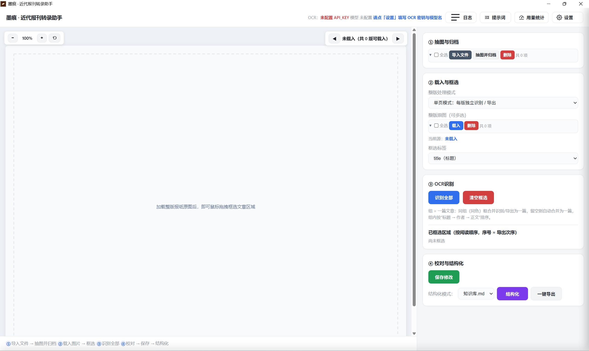
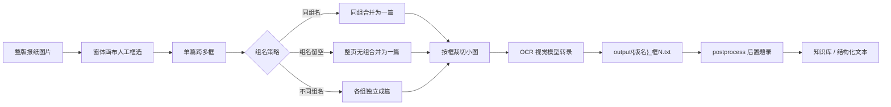

<p align="center">
  
</p>

<h1 align="center">墨痕</h1>

<p align="center"><strong>近代报刊转录助手 · 人工框选，把竖排繁体报纸变成可引用的文本。</strong></p>

<p align="center">
  在桌面窗体画布上框选每篇文章，裁切小图发 OCR，自动出规范题录。产物可直接导入知识库或形成史料长编。
</p>

<p align="center">
  
  
  
  
</p>

<p align="center">
  <a href="#下载">⬇️ 下载安装包</a>
  · <a href="#快速开始">📖 快速开始</a>
  · <a href="#主要功能">✨ 主要功能</a>
  · <a href="#工作原理">⚙️ 工作原理</a>
  · <a href="#适合什么场景">🎯 适合场景</a>
  · <a href="#不适用于什么场景">⚠️ 不适用场景</a>
</p>

<p align="center">
  
</p>

## 为什么做墨痕？

我整理近代报刊史料时，最常遇到的麻烦是：竖排繁体的民国报纸版面密、栏多、标题与正文常常分离，自动版面分析（PP-DocLayoutV3 等）对这类材料经常漏框、错框，而且要在本机备一套 1.6G+ 的推理栈才跑得起来。

我试了一圈，发现对史料转录来说，**精度比自动化更重要**——错一框，整篇文章的起始和归属就乱了。于是换了思路：让操作者在桌面窗体的画布上直接拖框，按阅读顺序框选每篇文章，框选的次序天然就是竖排多栏的阅读次序；复杂版面（跨栏、标题分离、插图穿插）就用「组」机制把多个矩形框并成一篇。

墨痕就是这套思路的实现：它不做自动标注，只负责把「框选 → 裁切 → OCR → 题录」这条链路在一个干净的窗体里走通，并能在你这台机器上打包成 exe，直接分发。

它不会替你“猜”版面，也不会自动把整版塞进模型。哪篇要转、边界在哪，永远由你框定；OCR 和题录的密钥只存在你本机，不会随安装包分发。

<a id="主要功能"></a>

## ✨ 主要功能

| 功能              | 能做什么                                                                                  |
| --------------- | ------------------------------------------------------------------------------------- |
| **画布人工框选**      | 在桌面窗体画布上拖拽矩形框，按阅读顺序框选每篇文章；竖排多栏次序由框选顺序天然保证。                                            |
| **单页 / 跨页模式**   | 单页逐版转录；跨页模式可把同一篇文章的多版合并识别，适合连载、续页。                                                    |
| **「组」合并机制**     | 一篇文章跨多个矩形（跨栏、标题分离、插图穿插）时，给同组框填相同组名，自动合并识别与导出；组留空则每框自成一篇。                              |
| **OCR 转录**      | 裁切小图发视觉模型（默认阿里云百炼 qwen3.7-plus，也可填豆包 Seed-2.0-Pro 等任意 OpenAI 兼容视觉模型），繁体竖排优先转简体、保留版面层级。 |
| **一键导出 + 后置题录** | 「导出并后置」一步到位：先落盘 `output/{整版名}_框N/*.txt`，再自动跑 `postprocess.py` 生成 `_题录.md`。            |
| **结构化整理**       | 一键把转录结果整理为知识库条目（`knowledge_base/*.md`）与纯文本（`plain_text/结构化_*.txt`），便于复制引用。            |
| **本地优先、可打包**    | 纯本地运行，密钥存本机；可打包成 `墨痕.exe`（onedir），目标机器无需装 Python。                                      |

<a id="适合什么场景"></a>

## 🎯 适合什么场景

- **版面复杂**的民国竖排繁体报纸、期刊的逐篇转录，且自动版面分析经常漏框、错框；
- 一篇文献跨多栏、标题与正文分离、中间穿插插图，需要人工界定边界；
- 同一篇文章在相邻几版连载，希望合并识别而非逐版重来；
- 需要可引用的规范化题录（出处 + 转录文本）来导入知识库或制作史料长编，而不仅仅是产生一堆零散截图和文本；
- 想把手头的转录工具打包成 exe，直接分发；
- 对“密钥不出本机、产物可审计”有要求，不愿把配置塞进安装包。

<a id="不适用于什么场景"></a>

## ⚠️ 不适用于什么场景

- **无法下载 PDF 或图片文件的在线史料数据库**：墨痕需要先拿到可本地加载的整版图片，无法绕过数据库的只读浏览或 DRM 保护；
- **版面十分简单**的近代图书、报刊、档案：若页面结构单一、文字连续、**使用 Paddle OCR、MinerU 等自动 OCR 已能直出时，人工框选反而多此一举**。

<a id="工作原理"></a>

## ⚙️ 工作原理



墨痕把“识别哪篇、边界在哪”完全交给人。框选完成后，程序按框裁切小图并发给视觉模型转录；**同组名的多个框、或均未填组名的多个框会按顺序合并成一篇**，字段（标题 / 作者 / 正文）严格按你框上的标签归位，不做模型内部的二次拆分；**不同组名的框则各自独立成篇**。转录文本落盘后，`postprocess.py` 负责出规范题录与结构化整理。

OCR 与题录所需密钥默认存于本机 `box_config.json`，首次启动自动生成空白配置文件；**密钥不会随安装包分发**，安装后自行填写。

<a id="下载"></a>

### 系统要求

**Windows**
- **Windows 10 / 11**（64 位）；
- 安装 / 运行**不需要 Python**；
- 需要 **Microsoft Edge WebView2 Runtime**——绝大多数 Win10/11 已自带。

**macOS**
- **macOS 14（Sonoma）及以上**；
- 支持 **Apple Silicon（arm64）** 与 **Intel（x86_64）** 双架构；
- 安装 / 运行**不需要 Python**，pywebview 使用系统自带 WebKit（无需 WebView2）；
- 提供 `.dmg` 安装包与 `.zip` 绿色版，通过 GitHub Releases 下载。

### 安装行为

- 默认装到用户目录 `C:\Users\<用户名>\AppData\Local\Programs\墨痕\`（用户级，免 UAC 提权）；
- 创建桌面与开始菜单快捷方式，装完可立即启动；
- 首次启动自动生成空白 `box_config.json`，由使用者自行填写 OCR / 题录密钥。

> ⚠️ **红线**：安装包采用白名单，仅收录 `墨痕.exe` + `_internal\*`。`box_config.json`、运行产物 `output/`、`cropped_hi/`、源图 `source/` 与日志均不进包，密钥绝不外泄。

<a id="快速开始"></a>

## 📖 快速开始

### 源码模式（开发 / 调试）

```powershell
cd <项目根目录>/scripts

# 1) 启动桌面窗体（首次启动自动创建空白 box_config.json，关窗即退出，无 CMD 黑框）
pythonw box_launcher.py
#   或直接双击 scripts/run_box.bat（自动探测 ..\build_venv\Scripts\pythonw.exe）

# 2) 在窗体「配置文件」面板填好 OCR 密钥与模型名 → 点「保存到配置文件」
#    （保存即落盘 box_config.json，每次请求实时重读，无需重启）
#    不填 OCR 密钥也能跑，只是走 dry_run 模拟返回。

# 3) 窗体内：点「运行抽图(阶段0)」→ 载入整版图 → 按阅读顺序框选每篇 → 「识别全部」
#    复杂版面下，一篇文章跨多个矩形：把同一篇的多个框填相同「组」名，自动合并识别/导出
#    （组留空则每框自成一篇）。

# 4) 「导出并后置」一步到位：先落盘 output/{整版名}_框N/*.txt，再自动跑 postprocess.py 生成题录。
#    也可分步：「导出 txt」+「运行后置」。

# 阶段 0 也可在窗体外单独跑：python extract_original.py（source/ → cropped_hi/）
```

### 安装包模式（适用于绝大多数用户）

**Windows**

1. 把 `deploy\Output\墨痕-v1.0.0-windows-setup.exe` 交给使用者，双击安装；
2. 启动「墨痕」，在设置面板填 OCR 密钥与模型名（使用者自己的 key）；
3. 其余操作与源码模式第 3、4 步相同。

**macOS**

1. 从 GitHub Releases 下载对应架构的安装包：
   - Apple Silicon（M 系列芯片）：`墨痕-v1.0.0-macos-arm64.dmg`
   - Intel（x86_64）：`墨痕-v1.0.0-macos-x86_64.dmg`
2. 打开 `.dmg`，将「墨痕」拖入「应用程序」文件夹；
3. 首次启动若提示「无法打开」，前往「系统设置 → 隐私与安全性」，点击「仍要打开」；
4. 启动后在设置面板填写 OCR 密钥与模型名。

更详细的图文步骤见 Gitee 图文使用教程：https://gitee.com/dabuxiaobu/mohen-tutorial

<a id="配置密钥"></a>

## 🔑 配置密钥

服务首次启动会**自动创建空白 `scripts/box_config.json`**，无需手动复制示例或手编 JSON。两种配置方式（优先级：环境变量 > 配置文件）：

1. **窗体设置面板（推荐，免重启）**：桌面窗体右上角齿轮打开设置抽屉，在「配置文件」填各项 →「保存配置」落盘。OCR 的 `BOX_OCR_API_KEY/BASE_URL/MODEL` 与后置题录的 `DEEPSEEK_API_KEY/MODEL/BASE_URL` 都在这里填；面板填的值在每次 OCR 请求时也即时生效（覆盖文件）。
2. **环境变量**：`$env:BOX_OCR_API_KEY="你的key"; $env:BOX_OCR_MODEL="qwen3.7-plus"; pythonw box_launcher.py`。

| 变量                   | 作用                              | 默认 / 示例                                    |
| -------------------- | ------------------------------- | ------------------------------------------ |
| `BOX_OCR_API_KEY`    | OCR 密钥（空 = 模拟 dry_run）          | 你的视觉模型 key                                 |
| `BOX_OCR_BASE_URL`   | 视觉接口地址                          | `https://dashscope.aliyuncs.com/compatible-mode/v1` |
| `BOX_OCR_MODEL`      | 千问 `qwen3.7-plus`；或豆包 `ep-xxxx` 等 | `qwen3.7-plus`                             |
| `DEEPSEEK_API_KEY` 等 | 后置题录必填（写文件 / env）               | 阶段 4 出 `_题录.md`                            |

**模型不写死**：想换豆包 / GPT-4o / 通义千问 VL / 火山方舟 `ep-xxxx` 等，只改 `BOX_OCR_BASE_URL` + `BOX_OCR_MODEL` 即可。状态栏 `● 已配 / ○ 未配` 只反映「显式配置」的键，默认兜底项不误报。

<a id="已知限制"></a>

## ⚠️ 已知限制

- OCR 质量依赖所选视觉模型对竖排繁体的处理能力，识别不清处应以 `□` 占位而非臆补；
- 框选精度 100% 由人保证——框偏了、框漏了，转录结果也会偏或漏；
- 跨页合并依赖你在各版填相同组名 / 相同文章标识，程序不会自动判断“哪几版是同一篇”；
- 后置题录（`postprocess.py`）需要有效的题录密钥，未配置则只产出原始转录 txt；
- 运行需要联网访问 OCR / 题录服务；纯本地仅完成框选与裁切，转录环节必须联网；
- 安装包不自带 WebView2 运行库（默认），缺库环境需另行安装。

<a id="roadmap"></a>

## 🗺️ Roadmap

- 继续打磨单页 / 跨页模式下的计数、组名、结果面板一致性；
- 优化竖排繁体 → 简体的版面还原与字段归位准确率；
- 完善结构化整理与知识库条目的可引用格式；
- 让安装包可选内嵌 WebView2 引导程序，降低目标机器环境门槛；
- 持续强化打包红线的自动化校验（密钥 / 运行产物绝不进包）。

<a id="开发与构建"></a>

## 🛠️ 开发与构建

### 源码模式运行

需要 Python 3；依赖装于项目根目录下 `build_venv`（首次 `build_exe.bat` 会自动准备）：

```bash
cd <项目根目录>/scripts
pythonw box_launcher.py
```

### 打包为 exe / 安装包

```powershell
cd <项目根目录>
# 完整重打包（含本轮全部修复）：清理缓存 → 准备 venv → PyInstaller → 产物
build_exe.bat
# 产物：dist\墨痕\墨痕.exe（onedir，含 _internal\ 依赖）

# 编译中文向导安装包（需本机已装 Inno Setup）
# 1) 把 ChineseSimplified.isl 放在 deploy/（已随仓库提供）
# 2) 用 Inno Setup 的 ISCC 编译：
" C:\Program Files (x86)\Inno Setup 6\ISCC.exe" deploy\墨痕_setup.iss
# 产物：deploy\Output\墨痕-v1.0.0-windows-setup.exe
```

> 构建红线：`build_exe.bat` 改动 `scripts/` 后**必须完整重打包** exe 才生效；`SKILL.md`、教程、部署脚本等非打包文档改动即时生效。  
> 分发红线：安装包白名单只收 `墨痕.exe` + `_internal\*`，密钥与运行产物绝不进包。

### macOS 构建（需在 Mac 上执行）

macOS 版使用独立的 `macOS/` 构建体系（`box_tool_mac.spec` / `build_mac.sh` / `run_box.sh`），与 Windows 的 `box_tool.spec` / `build_exe.bat` / `.iss` 互不干扰：

```bash
# 在 macOS 上本地构建（单次，单架构）：
cd <项目根目录>
MH_ARCH=arm64 bash macOS/build_mac.sh
# 产物：dist/墨痕.app（onedir）→ deploy/Output/墨痕-v1.0.0-macos-arm64.dmg / .zip
```

## 隐私与许可

- 本地框选、裁切、产物整理默认只在用户本机进行；
- OCR 与题录所需密钥保存在本机 `box_config.json`，**不随安装包分发**；
- 转录环节需将裁切小图发送给你所配置的视觉模型 / 题录服务，受对应服务隐私政策约束；
- 本工具为个人学术用途工具，源码随本仓库提供；如需对外分发，请遵守相应许可并自行移除任何个人配置。

### 许可证

墨痕（mohen）自有代码依据 **GNU Affero General Public License Version 3 only** 发布（SPDX-License-Identifier: `AGPL-3.0-only`）。完整条款见 [`LICENSE`](LICENSE)；发行包内第三方组件的许可证见 [`THIRD_PARTY_NOTICES.txt`](THIRD_PARTY_NOTICES.txt)。

---

墨痕的目标很简单：**让近代报刊的逐篇转录，回到“人框定边界、机器负责抄写”的可靠分工——既保住史料精度，也省下反复对版的体力活。**
