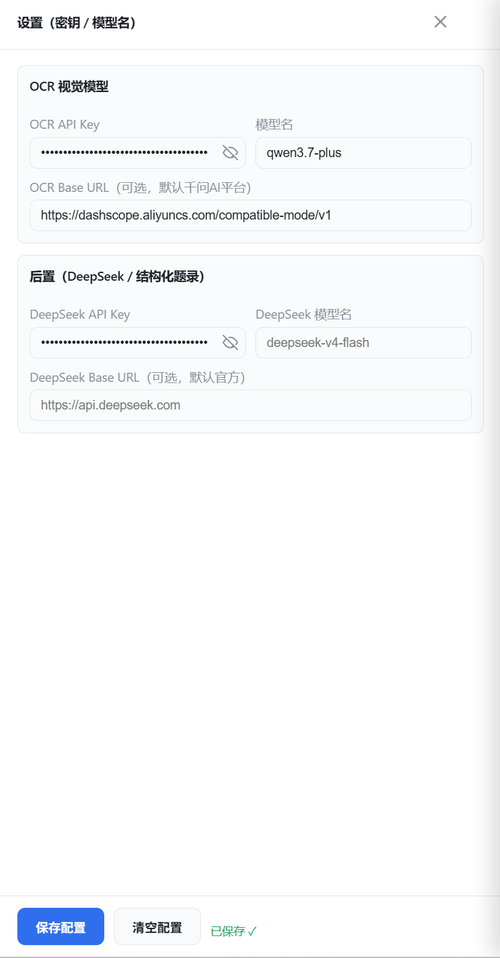
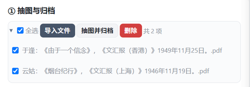
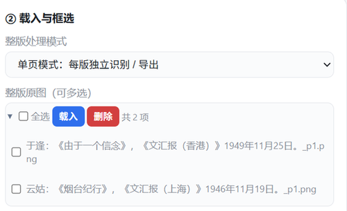
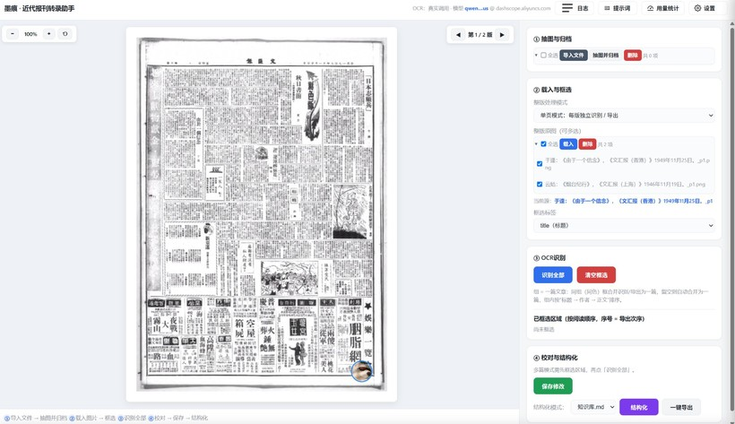
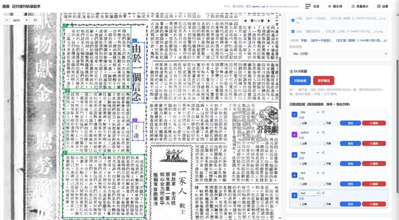
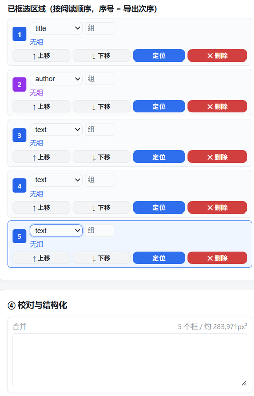
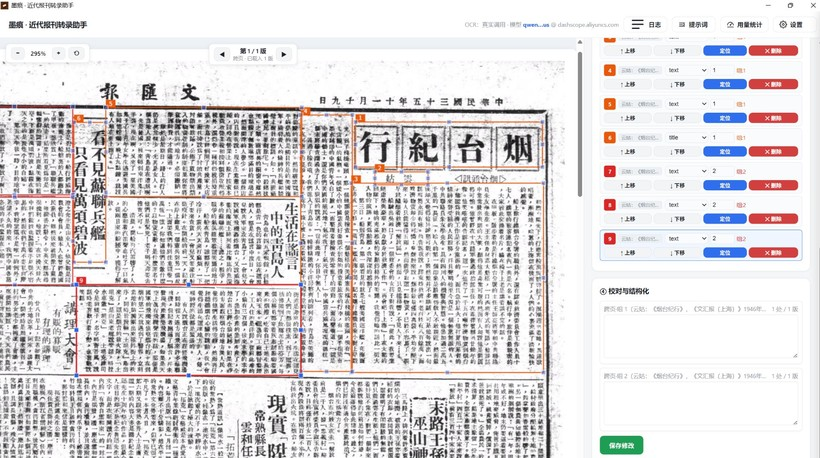
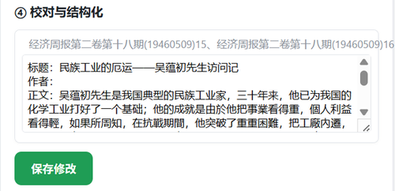

# 墨痕· 近代报刊转录助手 使用教程（零基础版 · 详细图文）

> 本工具是 `modern-newspaper-ocr` 的「人工框选」变体：绕过 PP 自动标注，改为在桌面窗体画布上**手动拖拽框选**每篇文章区域，裁切小图发 OCR（默认阿里云百炼 qwen3.7-plus，可换任意 OpenAI 兼容视觉模型），再由自带脚本出后置题录。精度 100% 由人保证，竖排多栏阅读顺序按框选次序天然正确。
>
> 窗体为独立 pywebview 桌面程序（无浏览器地址栏、无 CMD 黑框），可打包成 exe 在多设备运行。

---

## 〇、使用本工具前需要准备什么

| 序号 | 需要准备 | 说明 |
|------|----------|------|
| 1 | **一台 Windows 10/11 或 macOS 14+ 电脑** | Windows 版为 exe；macOS 版为 dmg/zip（见 GitHub Releases）。只要能正常运行桌面程序即可。 |
| 2 | 联网 | 识别文字需要调用云端服务，断网不能用。 |
| 3 | 你自己的民国报纸图片或 PDF | 工具不提供史料，只负责识别你给的文件。 |
| 4 | 一组你自己申请的 API Key | 相当于“调用云端识别服务的账号密码”。去阿里云百炼 / 火山方舟等平台自行申请（见第二节配置说明），**本软件不提供**。 |

---

## 一、安装与启动

### 方式 A：安装版（推荐普通用户）
从 GitHub Releases 下载对应安装包，**双击按向导安装即可**，会自动创建「开始菜单 / 应用程序」快捷方式：
- Windows：`墨痕-v1.0.0-windows-setup.exe`
- macOS：`墨痕-v1.0.0-macos-arm64.dmg`（Apple 芯片）/ `墨痕-v1.0.0-macos-x86_64.dmg`（Intel）

**首次启动会自动创建空白 `box_config.json`**，在设置面板自行填密钥即可使用。

### 方式 B：免安装便携版（多设备部署 / 直接分发）
> [配图：解压后的 `dist\墨痕\` 目录，含 `墨痕.exe` 与 `output/` 等]
把整份 `dist\墨痕\` 目录拷到目标电脑，双击 `墨痕.exe` 即可，**无需安装、不留注册表**；首次启动自动创建空白 `box_config.json`，使用者自行填密钥，无需本机装 Python。

### 方式 C：源码运行（开发 / 调试）
```powershell
cd <本技能>/scripts
pythonw box_launcher.py        # 无黑框；关窗即退出
# 或双击 scripts/run_box.bat（自动探测 ..\build_venv\Scripts\pythonw.exe）
```
> 源码模式改动即时生效；exe 模式需 `build_exe.bat` 完整重打包后才生效。

---

## 二、首次配置（API Key）

启动后，点窗体**右上角齿轮「设置」**打开配置抽屉，在「① 配置文件（API Key / 模型名）」填好六项 → 点「保存配置」。



| 配置项 | 作用 | 默认 / 示例 |
|--------|------|------------|
| `BOX_OCR_API_KEY` | OCR 服务密钥（**空 = 模拟 dry_run**，流程仍走得通） | 你的阿里云百炼 / 豆包 / OpenAI 兼容密钥 |
| `BOX_OCR_BASE_URL` | 视觉接口地址 | `https://dashscope.aliyuncs.com/compatible-mode/v1`（千问默认） |
| `BOX_OCR_MODEL` | 千问填 `qwen3.7-plus`；豆包填 `ep-xxxx`；其他填模型名（如 `gpt-4o`） | `qwen3.7-plus` |
| `DEEPSEEK_API_KEY` | **阶段 4 后置题录必填** | 你的 Ark DeepSeek 接入点密钥 |
| `DEEPSEEK_MODEL` / `DEEPSEEK_BASE_URL` | 后置用 | 默认火山方舟 Ark |

- 也可用环境变量注入（优先级最高，覆盖文件）：`$env:BOX_OCR_API_KEY="k"; $env:BOX_OCR_MODEL="qwen3.7-plus" pythonw box_launcher.py`。
- 保存后每次请求实时重读，**无需重启**；状态栏 `● 已配 / ○ 未配` 反映显式配置情况。
- `box_config.json` 含明文密钥，切勿外传。

---

## 三、界面总览

> [配图：墨痕主界面全景，标注 卡片①~⑤ 与右侧面板、右上角三按钮]


左下角流程提示为五步：**① 导入文件 → ② 抽图并归档 → ③ 选择整版原图 → ④ 框选 → 识别全部 → ⑤ 保存修改 → 结构化**。

| 区域 | 功能 |
|------|------|
| 卡片①「导入与归档」 | 导入本地 PDF / 图片到 `source/`；「抽图并归档」把 `source/` 抽成整版 PNG 到 `cropped_hi/`，并归档整版原图进 `output/` 作溯源 |
| 卡片②「载入与处理方式」 | 从 `cropped_hi/` 载入整版图（多选）；设「整版处理方式」开关（独立 / 合并）；设「校对模式」（需人工校对 / 免校对直出） |
| 卡片③ / ④「框选与识别」 | 画布框选、标签、分组；「识别全部」裁小图发 OCR |
| 卡片⑤「保存与结构化」 | 「保存修改」覆盖写回；「结构化」跑后置题录（知识库 / 纯文本）；「一键导出」汇总到 `oneclick` |
| 右侧「校对与结构化」面板 | 显示每篇识别结果，可手改；右键文本框有剪切/复制/粘贴/全选 |
| 右上角三个按钮 | **日志**（底部抽屉）、**提示词**（自定义模型指令）、**用量统计**（token 消耗） |

---

## 四、标准操作流程（单页模式）

> 单页模式：载入的每一版**独立**识别、独立导出，文件名不带 `_跨页`。

1. **导入文件**：卡片①点「导入文件」选本地 PDF / 图片（支持多选），写入 `source/`。

   > [配图：卡片①「导入文件」对话框选中多份 PDF]

2. **抽图并归档**：点「抽图并归档」，后端把 `source/` 整理为整版原图落到 `cropped_hi/`，并把整版原图归档进 `output/`（双备份溯源），自动刷新整版列表。**这一步 PDF 和图片都要走，不会跳过**：PDF 会先渲染每页成图，图片则直接登记并归档。

   

3. **载入整版图**：卡片②在整版列表勾选所需版本（推荐直接点顶部「全选」全选本批，再点「载入所选」；也可在「选择整版原图」下拉框挑单个版面载入）。

   

   

4. **框选**：

   

   - 鼠标在图上拖拽，按**阅读顺序**依次框出每篇文章区域。
   - 滚动鼠标**滚轮**可缩放画布，放大看细节、缩小看全貌，便于精准框选。
   - 每框可设**标签** `title（标题）/ author（作者）/ text（正文）`，下拉顺序即「标题→作者→正文」。
   - 框列表显示序号 = 导出次序，可删除 / `↑↓` 调序；画布上**右键框体可删除**（阻止浏览器默认菜单）。
   - **情形一：一页就是一篇（最常见，不用填组）**
     在一页上框了多块（比如标题一块、作者一块、正文若干块），**全部不填"组"**，软件会把这一页上所有无组框**自动合并成同一篇文章**，按你框选的先后顺序拼接。每块的"框选标签"（标题 / 作者 / 正文）仍各自归位，不会串。

     

   - **情形二：一页里有好几篇（用"组"区分）**
     同一版上有多篇独立文章时，给**属于同一篇**的各块填**完全相同的组名**（比如都填"组A"），软件就把它们合并成那一篇；**组名不同的块则各自算作不同的文章**，互不串扰。
     例：第 1 篇的标题 + 正文都填"组A"，第 2 篇的标题 + 正文都填"组B"，整理后就是两篇独立的稿子。

     

5. **识别全部**：逐框（或逐组）裁小图发 OCR；同组多框分别识别后按框顺序拼接 → 右侧结果卡片显示文本（可手改）。识别完自动导出 txt + json 初稿到 `output/`。

   

   - **无框严禁识别**：任何载入版未框选就点「识别全部」会直接弹窗报错，绝不整版兜底。

6. **保存修改（校对模式下）**：手改结果后点「保存修改」，把编辑覆盖写回 `output/` 的 txt + json。**单页模式会遍历所有已载入版逐版写回**，与当前停在哪一页无关。

7. **结构化**：点「结构化」跑 `postprocess.py`（阶段 4 后置题录）。**它会先自动保存当前识别结果（等同于点过「保存修改」），再结构化**，所以校对模式下不先点「保存修改」也能直接结构化。

   > [配图：点「结构化」选择「知识库」或「纯文本」模式]

   - 结构化完成后自动**归整工作区**：清空画布与结果、清空「载入与框选」文件列表、复位「当前源」显示，并**真正物理删除 `cropped_hi/` 里本次处理的整版源图**（因为 `output/` 已留存整版副本与产物，源图属残留）。单页每版各有独立子文件夹 `output/{top}/{整版名}/`。
   - 结构化失败（无产物）时不会清空工作区，便于排查。

---

## 五、跨页模式（多版合并为一篇）

> 适合一篇文章横跨多版（如连载、转版）的情形。

1. 卡片②把「整版处理方式」开关设为 **`cross`（合并）**，再勾选多版点「载入所选」。

   > [配图：卡片②「整版处理方式」开关切到 cross]

2. 各版分别框选（标签、分组规则同单页）。
3. **组（group）可跨页合并**：同一 `group` 名分散在多页的框会合并成一篇；无组框跨页也按阅读顺序合并成一篇。
4. 点「识别全部」→ 多版结果按 `pageOrder` 阅读顺序合并成一篇，文件名自动为 `{第一版名}_跨页`。
5. 点「结构化」→ 自动落盘合并产物，后置题录归到 `output/{top}/{第一版名}_跨页/`。
   - 跨页结构化后同样自动归整：清空工作区、**物理删除 `cropped_hi/` 源图**、并清理 `output/` 根下 `{}` 跨页 raw 中转空目录（真正产物在 `output/{top}/` 下，不受影响）。

> 跨页文件名暂自动取「第一版名 + `_跨页`」；如需自定义可在右侧编辑区修改。

---

## 六、框选与分组的诀窍

> [配图：同一版上「一页一篇」与「一页多篇」两种框选对照示例]

| 场景 | 怎么框 | 结果 |
|------|--------|------|
| **一页一篇**（最常见） | 标题 / 作者 / 正文各画一框，**组都留空** | 这些无组框合并成一篇；标题框→标题、作者框→作者、正文框→正文 |
| **一页多篇** | 给每篇的框打**相同的组名**（不同篇用不同组号） | 同组框合并成一篇、不同组互不串 |
| **一篇跨多栏 / 标题分离** | 把属于同一篇的所有框填**相同组名** | 合并为一篇，组内按「标题→作者→正文」排序 |
| **框选标签** | 每框标 `title/author/text` | OCR 后内容严格归到该标签字段（副标题、作者署名按框所在标签落位，不会错进其他字段） |

**标签归位规则**：框选标签决定整框归哪个字段，OCR 模型内部的「标题：/作者：/正文：」拆分一律视为噪声。例如把含副标题「——吴蕴初先生访问记——」的整框标 `title`，副标题就会进标题而非正文；把署名框标 `author`，署名只出现一次、不会重复。

---

## 七、校对：结果编辑框右键菜单

> [配图：右侧结果文本框内右键弹出的「剪切 / 复制 / 粘贴 / 全选」菜单]

在右侧「校对与结构化」面板的**结果文本框内点右键**，会弹出自定义菜单：**剪切 / 复制 / 粘贴 / 全选**（而非浏览器默认无功能菜单）。粘贴优先读系统剪贴板，失败回退浏览器粘贴；插入后自动同步到内部结果。菜单随外部点击 / 滚动 / 失焦自动关闭。

---

## 八、一键导出

点「一键导出」把本轮产出（知识库 `.md` 或纯文本 `.txt`，或两者皆有）**统一平铺**进唯一 `output/oneclick/` 文件夹，自动打开该文件夹。

> [配图：一键导出后打开的 output/oneclick/ 文件夹，md 与 txt 平铺]

- 不再每次生成时间戳子文件夹，也不分「知识库 / 纯文本」子文件夹。
- 多次导出、不同模式产物都进同一个 `oneclick/`，同名覆盖、无重复文件夹。
- 若只有 `.md` 或只有 `.txt` 一种产物，也只往 `oneclick/` 放对应文件，绝不额外建空文件夹或「未命名」占位。

---

## 九、产物目录说明

```
output/
  {整版名}/            # 抽图归档时复制的整版原图（溯源用）
  {top}/               # 结构化按轮归集的父目录（top = knowledge_base 或 plain_text）
    {整版名}/          # 单页：每版独立子文件夹（原图/识别 txt/json + 结构化结果）
    {第一版名}_跨页/   # 跨页：合并单文件夹
  oneclick/            # 一键导出汇总（平铺，无时间戳/无子文件夹）
```

- `{top}` = `knowledge_base`（知识库模式，`.md` 题录）或 `plain_text`（纯文本模式，文件名以「结构化」开头的 `.txt`）。
- OCR 初稿为同名无前缀 `.txt` / `.json`，由识别阶段平铺落盘；结构化阶段经 `_gather_round()` 收拢进对应轮目录，并生成带「结构化」前缀的成品 `.txt` 或 `.md`。
- 每版子文件夹内还含**整版原图 `.png`**（抽图归档时复制的整版报纸图片，作溯源用）。

---

## 十、主界面上的三个辅助按钮：日志 / 提示词 / 用量统计

窗口**右上角**还有三个辅助面板按钮，日常流程可不用，但排查问题和优化效果时会用到：


- **日志**：显示软件运行日志，包括 OCR / 结构化是否成功、报错信息等。日志会**持久化保存**，关掉软件重开也能看到历史记录，排查问题时先看这里。
- **提示词**：显示当前 OCR 识别和结构化后处理使用的提示词（即告诉模型怎么整理文字的指令）。可在此修改自定义提示词，保存后**立即生效**；想恢复默认通常有「恢复默认」按钮。
- **用量统计**：汇总模型调用次数、token 消耗、耗时。按模型和阶段（OCR / 结构化）分别统计，便于估算成本、看哪个阶段花费最多。OCR 调用**按组**统计（一组 = 一次识别，无组多框自动合并为一篇也算一次）。

> 💡 新手可以先不管这三个按钮，正常走导入 → 框选 → 识别 → 结构化流程即可；跑熟了再回来研究提示词和用量统计。

---

## 十一、用量统计

> [配图：右上角「用量统计」抽屉，按模型 / 阶段列出 token 与耗时]

右上角「用量统计」抽屉按模型 / 阶段聚合 token 消耗与平均耗时，便于核算成本。OCR 调用**按组**统计（一组 = 一次识别，无组多框自动合并为一篇也算一次）。

> 实测成本参考（以千问 qwen3.7-plus 计，与豆包同量级；DeepSeek 题录）：每千字约 ¥0.085；控制框数（= OCR 调用次数）比纠结模型单价更省。

---

## 十二、常见问题与注意事项

- **为什么画布图片不显示？** 旧版曾有「图片需点击才显示」的 bug（HTML 元素被删但 JS 仍引用），当前版本已修复；若仍异常，看「日志」抽屉有无报错。
- **为什么提示「没有可结构化的 OCR 产物」？** 必须先在卡片④完成框选 + 识别全部，让 `output/` 下有对应 `.txt/.json/原图`。空工作集点结构化会被直接拦截。
- **结构化后文件列表 / 当前源怎么清空了？** 这是正常归整行为：工作区清空、源图物理删除（产物已留存 `output/`）。无需担心丢失。
- **改了源码不生效？** 若用 exe，必须 `build_exe.bat` 完整重打包；源码模式（`pythonw box_launcher.py`）改完即时生效。
- **机密提示**：`box_config.json` 含明文密钥，不得随打包外传；`source/`、`cropped_hi/`、`output/` 为运行产物，不列入打包。
- **多开限制**：程序已加单实例锁，重复双击会提示「程序已经在运行了，请回到已打开的窗口」，不会多开抢端口。
